# Memento - Visual Memory Test

[Memento](https://andreeeasn.github.io/pp2-memento/) was developed for people interested in testing or improving their visual memory skills through a short and simple browser game.
In this game you'll be given a short timer to remember all highlighted tiles, and then select as many of them as you can recall.
Get 3 incorrect tiles and lose a life, lose 3 lives and you're out.
The levels gradually increase in difficulty, how far can you make it?

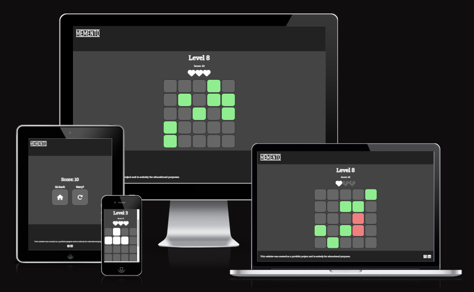

# Table of Contents
+ [UX](#ux "UX")
  + [User Demographic](#user-demographic "User Demographic")
  + [Design](#design "Design")
  + [Typography](#typography "Typography")
+ [Flowchart](#flowchart "Flowchart")
+ [Features](#features "Features")
  + [Header](#header "Header")
  + [How to play](#how-to-player "How to play")
  + [Game Over screen](#game-over-screen "Game Over screen")
  + [Footer](#footer "Footer")
  + [Future Features](#future-features "Future Features")
+ [Deployment](#deployment "Deployment")
  + [GitHub Pages](#github-pages "GitHub Pages")
+ [Testing](#Testing "Testing")
  + [General Testing](#general-testing "General Testing")
  + [Validator Testing](#validator-testing "Validator Testing")
  + [Bugs Encountered](#bugs-encountered "Bugs Encountered")
+ [Credits](#credits "Credits")

# UX

## User Demographic
This website was designed to:
  - Provide a simple browser game for those wanting to test their memory.
  - Allow returning users to practice their visual memorization.
  - Be quick and accesible enough to be played during shorter breaks/downtime.
 
## Design
- As the game revolves around remembering visual patterns, a minimalistic greyscale design was adopted to reduce visual clutter.
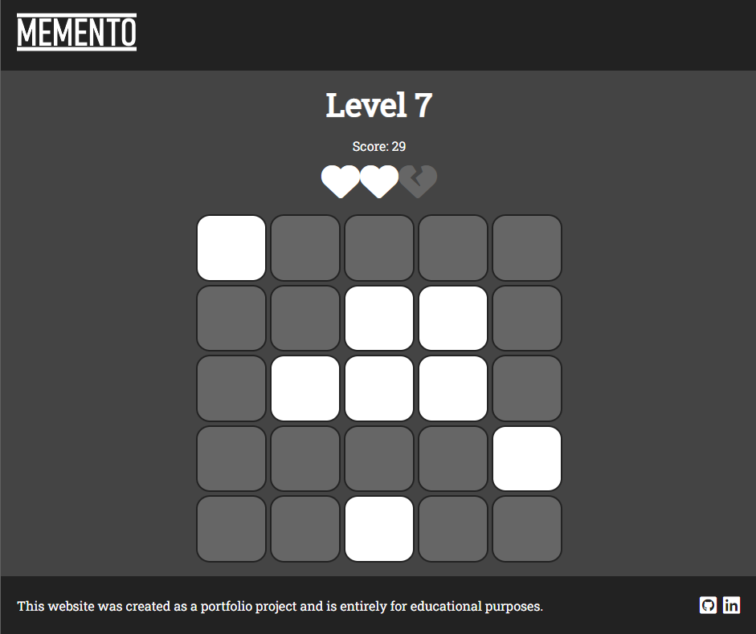
- Upon clicking a button or tile their color will change to a darker gray to provide a sense of physicality, as if a button is being pressed.
- The only time more vivid colors are used are light hues of green/red to signal correct/incorrect selections respectively.

  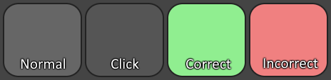

- Buttons are also styled to resemble the tiles used in-game with a Font-awesome icon featured on it.

  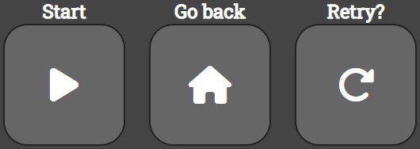

## Typography
- All text on the website uses the Google font "Roboto Slab" as it appears modern yet simplistic which adheres to our overarching design goals.
- The Memento logo was created using the font "Bahnschrift Condensed".

# Flowchart
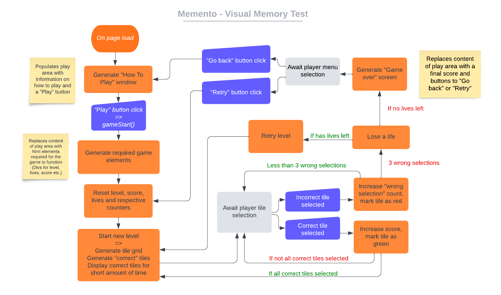

# Features

## Header
- The top left of the page features the Memento logo, on smaller screen sizes this logo will be centered.
  
  
  
- Upon clicking the logo the page will be refreshed, restarting the game

## How to play
- On page load the user will be greeted by a window with instructions on how to play
  
  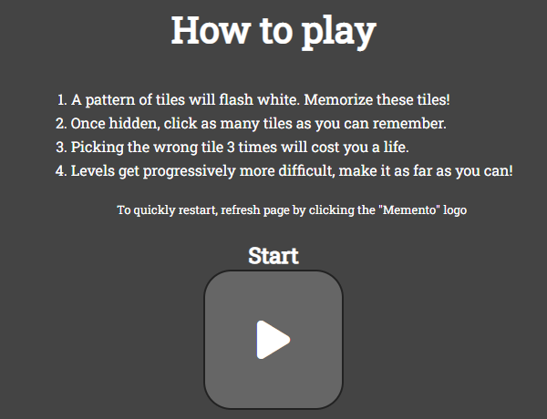
  - Clicking the play button will clear the play area and boot up the game

## Game Over screen
- On losing 3 lives the player will be presented a menu showing their final score
  
  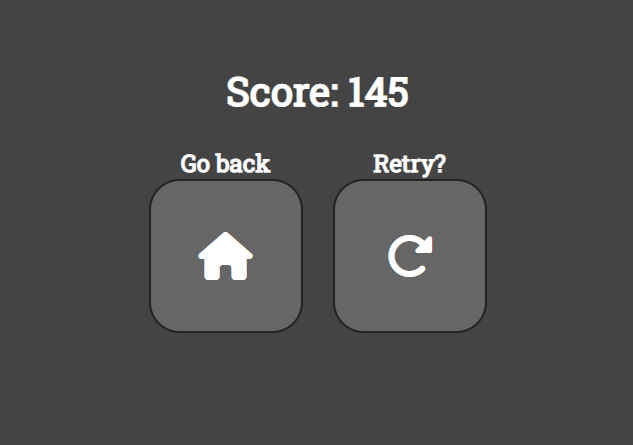
  - "Go back" will return the user to the "How to play" menu
  - "Retry" will reset the game so the user may play again.

## Footer
- The bottom of the page features a disclaimer that the website is a portfolio project and links to the creator's GitHub and LinkedIn
  - The footer is fully responsive at any screen size
  

    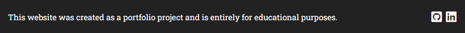

    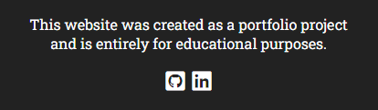

  - The links both open in a new window/tab on click

## Future Features
As the functionality of grid generation and tile interaction have already been implemented, re-using these for different gamemodes might prove an interesting idea
- Time Trial
  - Final score based on time passed rather than tiles clicked
  - Less focus on lives, incorrect tile selections add seconds to the timer instead
  - Finish line is at specified level rather than being infinite
- "Game" mode
  - Less serious approach, features a limited amount of hints
  - Hints can be restored by selecting tiles that glow yellow instead of white during reveal
  - Hint tiles are rare towards the start but become more common at higher levels

# Development

## GitHub Pages
The project was deployed to GitHub Pages (Link [here](https://andreeeasn.github.io/pp2-memento/)) using the following steps:
  1. Log in to GitHub and locate your project repository
  2. At the top of the repository, select the "Settings" option from the menu
  3. Find the "Pages" option in the list of settings
  4. Find the "Branch" option and select your desired branch ("None" by default, set to "Main") and root ("/(root)" by default)
  5. Select "Save" and your page will be deployed to GitHub Pages
  6. Refresh the page and you should be presented with "Your site is live at: (LINK)" at the top of the page

If the link doesn't appear after refreshing your page, wait for a few minutes before trying again

# Testing

## Validator Testing

- HTML
    - No errors were returned when testing all the pages through the [W3C HTML Validator](https://validator.w3.org/nu/?doc=https%3A%2F%2Fandreeeasn.github.io%2Fpp2-memento%2Findex.html)  
  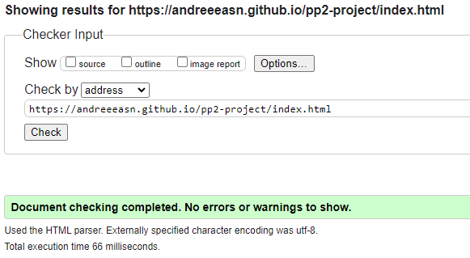

- CSS
  - No errors were returned when testing style.css through the [W3C CSS Jigsaw Validator](https://jigsaw.w3.org/css-validator/validator?uri=https%3A%2F%2Fandreeeasn.github.io%2Fpp2-memento%2Findex.html&profile=css3svg&usermedium=all&warning=1&vextwarning=&lang=en) 
  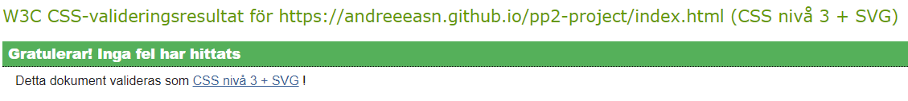

- JSHint
  - No errors were returned when testing script.js through the [JSHint Linter](https://jshint.com/) (using /* jshint esversion: 6 */) 
  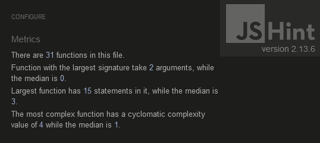 

- Lighthouse Audit 
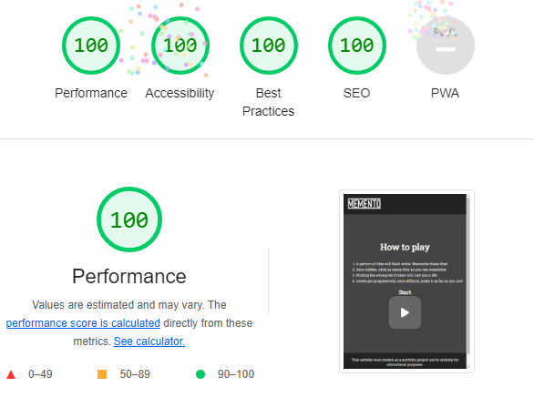

## Bugs Encountered
  - [RESOLVED] Favicon not loading properly on deployed website
    - This was fixed by changing the href path of the icon in index.html "<strong>/assets</strong>/[...].png" to "<strong>assets</strong>/[...].png" as the former is considered an absolute path and is not supported
  - [RESOLVED] EventListeners attached to HTML elements not reacting to inputs
    - Fixed by replacing addEventListener("onclick", gameStart) with addEventListener("click", gameStart)

# Credits
Resources and tutorials used for developing this project:
- [Stop footer from floating up a short page](https://www.youtube.com/watch?v=yc2olxLgKLk) by youtuber [Kevin Powell](https://www.youtube.com/@KevinPowell)
- [StackOverflow - Generate unique random numbers](https://stackoverflow.com/questions/2380019/generate-unique-random-numbers-between-1-and-100/2380113#2380113)
- [Human Benchmark](https://humanbenchmark.com/), a website that measures abilities with cognitive tests and inspired Memento's creation

Huge thanks to my Code Institute mentor, [Lauren-Nicole Popich](https://www.linkedin.com/in/lauren-nicole-popich-1ab87539/) for providing guidance and expertise despite a jam-packed schedule.